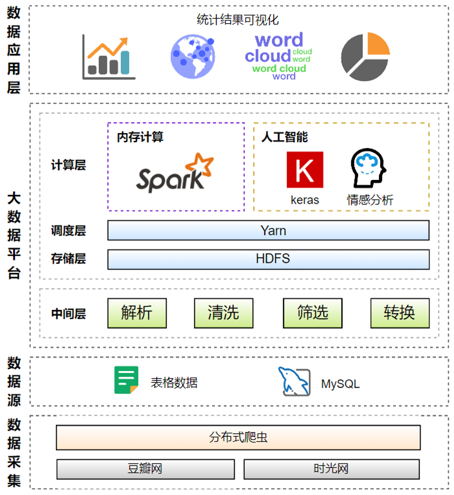

# 基于电影网站评论的情感分析系统

2022 年重庆大学《大数据架构与技术》课程项目。

## 项目架构



## 技术栈

|模块|技术栈|
|---|---|
|分布式爬虫|Scrapy-Redis、MySQL|
|大数据环境搭建|Hadoop、HDFS、Spark、Hive、Sqoop|
|数据处理|Spark|
|神经网络情感分析|keras、Bi-LSTM|
|结果可视化|Pyecharts、bar_chart_race|

## 目录结构

### src

目录结构如下：

```py
D:.
├─crawler  # scrapy-redis分布式爬虫
│  ├─data  # 爬取的数据
│  │  ├─movie_ids
│  │  ├─test_set
│  │  └─train_set
│  └─src   # scrapy项目结构
│      ├─requests_crawler
│      │  └─comment_results
│      └─scrapy_crawler
│          ├─douban_dist
│          │  └─douban_dist
│          │      └─spiders
│          └─douban_single
│              └─douban_single
│                  └─spiders
├─dl  # 神经网络模型
│  ├─models  # 模型参数
│  ├─modules  # 模块
│  ├─preprocess  # 数据预处理、模型预测
│  └─train  # 模型训练
├─stats  # spark统计结果
└─visualize  # pyecharts数据可视化
    ├─figures  # html
    ├─pics  # html对应的图片
    ├─result  # spark统计结果
    ├─util  # 工具函数
    └─video  # 动态追逐图视频
```

### docs

大数据框架环境搭建笔记，包括：

- `scrapy-redis`
- `hadoop`
- `hive`
- `spark`

### scripts

集群脚本，包括：

- `jpsall`：查看集群的jvm进程
- `myhadoop.sh`：hadoop集群的启动与停止脚本
- `xsync`：文件分发脚本