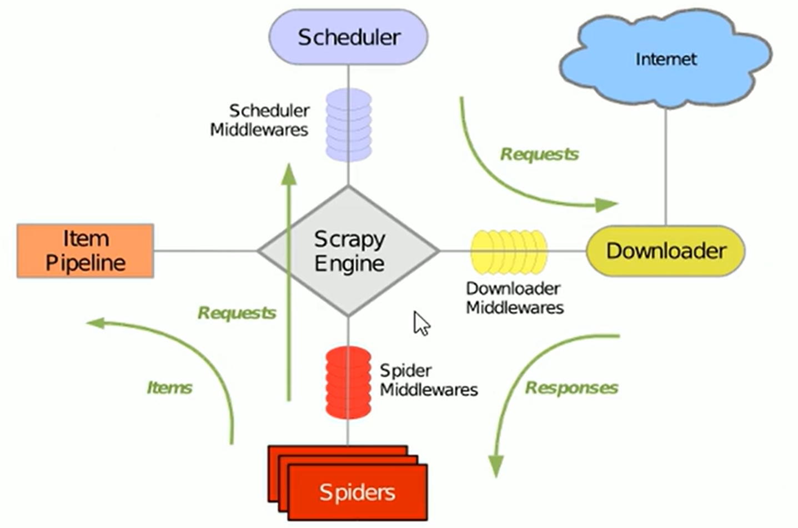
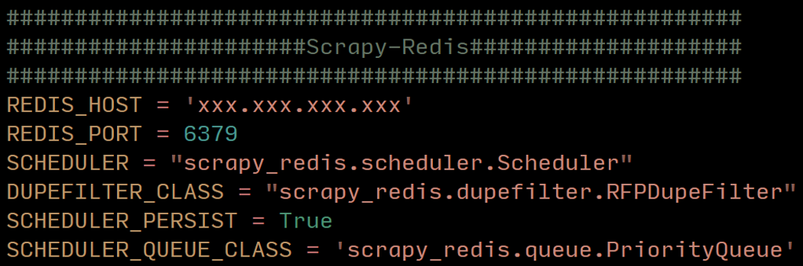

# Scrapy整体框架



scrapy运行流程如下：

1. Spider -> Scheduler：引擎从调度器中取出一个链接（URL）用于接下来的抓取
2. Scheduler -> Downloader：引擎把URL封装成一个请求（Request）传给下载器
3. Downloader：下载器把资源下载下来，并封装成应答包（Response）
4. Downloader -> Spider：下载器将应答包传给Spider，由Spider解析
5. Spider -> Pipeline：若Spider解析出实体（item），则交给实体管道处理；若解析的是链接（URL），则把URL交给调度器，继续等待抓取


在开发时，主要关注的是以下几个部分：

1. 程序编写，包括：

   - **Spider**：编写主要的爬虫程序，包括生成url请求`Request`、解析响应`Response`
   - **Pipeline**：接收Spider传过来的数据，持久化到外部系统，比如`excel`文件、`mysql、moongoDB`数据库等（注意写好后要启用`settings.py`中`ITEM_PIPELINES`配置）
   - **DownloadMiddlewares**：可以拦截请求和响应，比如拦截请求时添加请求头（注意写好后要启用`settings.py`中`DOWNLOADER_MIDDLEWARES`配置）

2. 配置信息，包括：

   - `settings.py`

## 创建Scrapy项目

打开终端：

```bash
scrapy startproject <项目名>
```

目录结构如下：
```py
D:.
│  scrapy.cfg  # 项目的基本配置文件
│
└─myfirst_scrapy
    │  items.py  # 封装模型（类似于实体类），用于结构数据
    │  middlewares.py  # 下载中间件
    │  pipelines.py  # item管道，用于数据持久化
    │  settings.py  # 具体配置文件，比如并发数、延迟下载等等
    │  __init__.py
    │
    └─spiders  # 存放爬虫文件
            __init__.py
```

### settings.py

配置文件中需要关注的字段：

```python
COOKIES_ENABLED = False  # cookie

DOWNLOAD_DELAY = 1  # 下载频率

USER_AGENT = 'Mozilla/5.0 (Windows NT 10.0; Win64; x64) AppleWebKit/537.36 (KHTML, like Gecko) Chrome/106.0.0.0 Safari/537.36'  # header里面的User-Agent

DEFAULT_REQUEST_HEADERS = {  # 请求头
  'Accept': 'text/html,application/xhtml+xml,application/xml;q=0.9,*/*;q=0.8',
  'Accept-Language': 'en',
}

DOWNLOADER_MIDDLEWARES = {
   'myfirst_scrapy.middlewares.MyfirstScrapyDownloaderMiddleware': 543,
}

ITEM_PIPELINES = {
   'myfirst_scrapy.pipelines.MyfirstScrapyPipeline': 300,  # key表示pipeline路径，value表示优先级。数字越小，优先级越高，越先启动。
}
```

## Spiders

在`Spiders`中，存放了所有的爬虫文件。爬虫文件形式如下：

```py
import scrapy

class BaiduSpider(scrapy.Spider):
    name = 'baidu'  # 爬虫的名字，启动的时候会用到（必写）
    allowed_domains = ['baidu.com']  # 爬取的域名，只爬含有该域名的网页（可选）
    start_urls = ['http://baidu.com/']  # 起始url

    def parse(self, response):  # 爬虫的响应
        print(response.text)  # 打印响应文本
```

如果`print()`没有输出，可能由如下原因：

- `start_urls`中的url没有写www
- `settings.py`配置文件中没有设置`User-Agent`
- `Settings.py`配置文件中`ROBOTSTXT_OBEY=True`


# Scrapy-Redis

`Scrapy-Redis`是一个分布式的爬虫框架，它只是在`Scrapy`的基础上加上了某些功能。

## 搭建Scrapy-Redis分布式环境

通常，可以以windows（本机）作为master端，以若干台Linux（虚拟机）作为slave端。

在windows上下载Redis，下载地址：[https://github.com/MicrosoftArchive/redis/releases](https://github.com/MicrosoftArchive/redis/releases)

## 将Scrapy项目修改为Scrapy-Redis项目

只需修改两个地方：

- `settings.py`添加如下信息：
  
- 将Spiders中的爬虫程序继承的类改成`RedisSpider`

## 不同的爬虫设置不同的配置

在`Spiders`文件夹的爬虫类中，不同的爬虫文件可以通过`custom_settings`设置不同的配置，比如自己的Item管道、自己的下载中间件。

举例：

```py
# 豆瓣 spider 
class DoubanSpider(RedisSpider):
    name = 'douban'
    allowed_domains = ['movie.douban.com']
    # 豆瓣的配置信息
    custom_settings ={
        'ITEM_PIPELINES':{'douban_dist.pipelines.MysqlPipeline': 300},
        'DOWNLOADER_MIDDLEWARES': {'douban_dist.middlewares.DoubanDistDownloaderMiddleware': 543}
    }
    def start_urls(self):
      pass
    def parse(self, response):
      pass

# 时光网 spider
class DoubanSpider(RedisSpider):
    name = 'mtime_movie_info'
    allowed_domains = ['http://front-gateway.mtime.com']
    custom_settings ={
        'ITEM_PIPELINES':{'douban_dist.pipelines.MtimeMovieInfoPipeline': 300,},
        'DOWNLOADER_MIDDLEWARES': {'douban_dist.middlewares.MtimeMovieInfoDownloaderMiddleware': 543}
    }  # spider对应的pipeline
    def start_urls(self):
      pass
    def parse(self, response):
      pass
```

需要注意的是，`middlewares.py`中要同步添加对应的类，`settings.py`中也要同步启用`ITEM_PIPELINES`。
